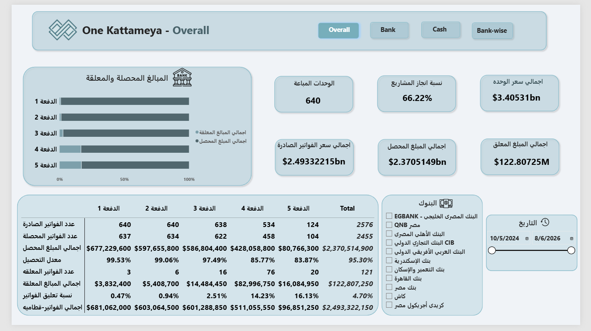
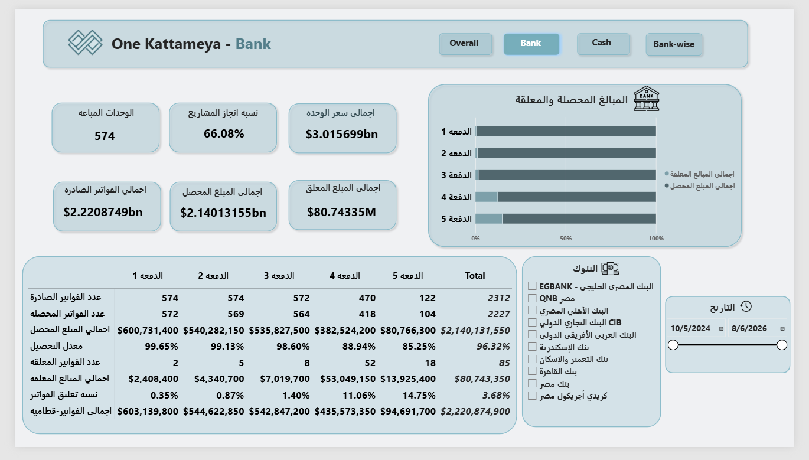
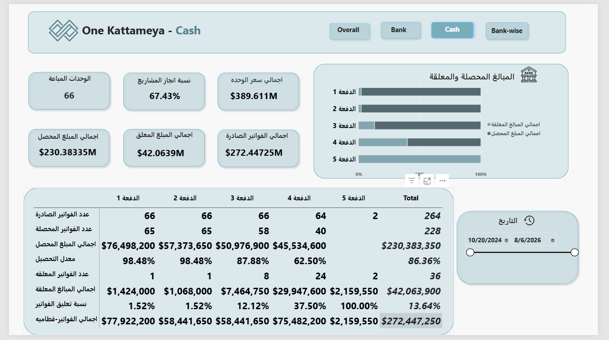
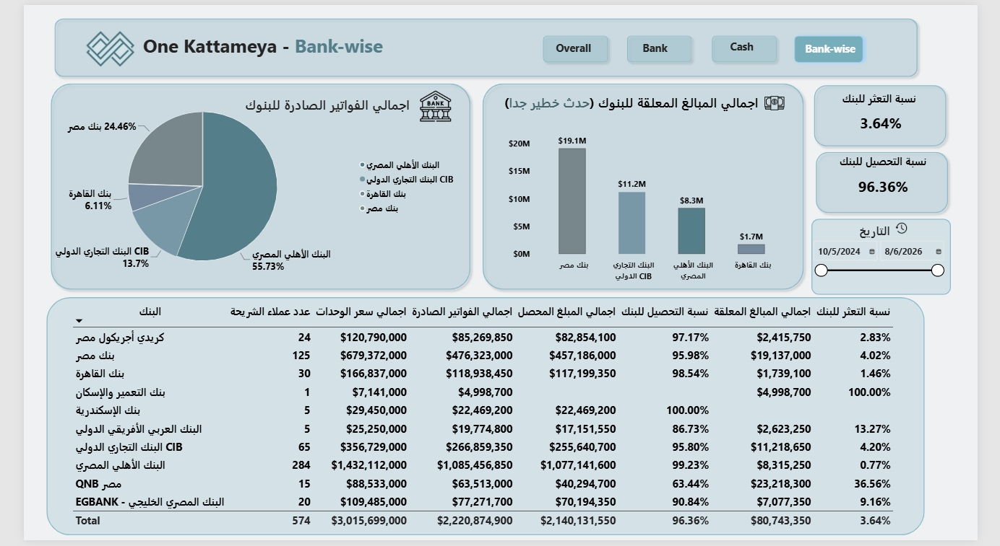
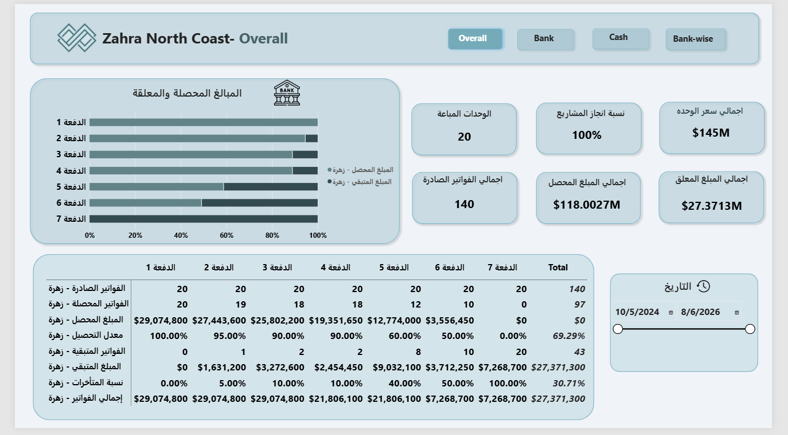
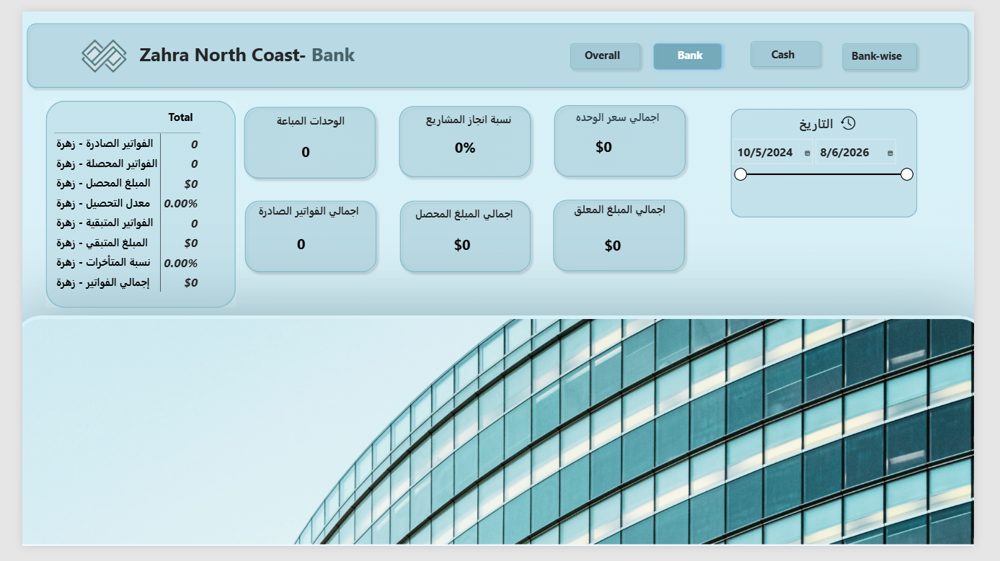
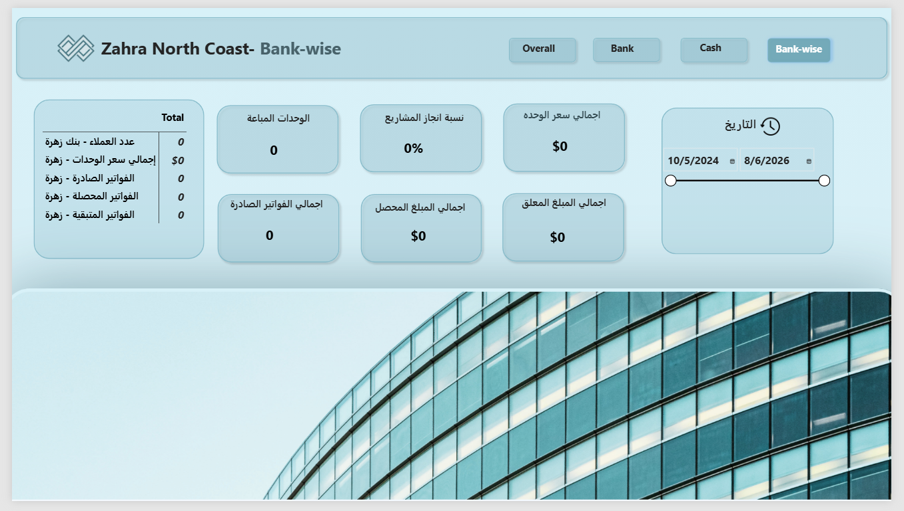
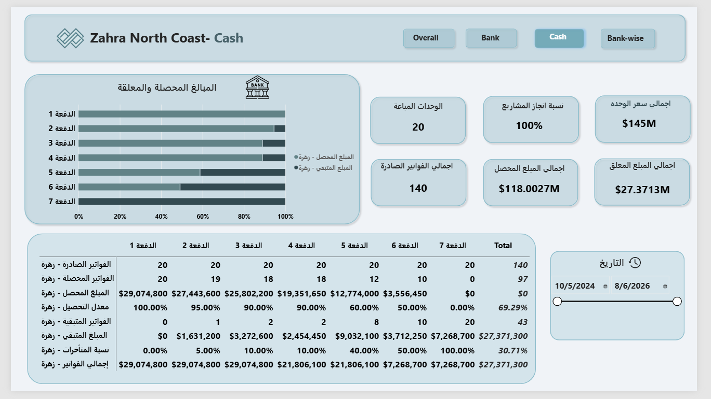

# 📊 Morshedy Real Estate - Enterprise Collection & Financial Risk Intelligence Dashboard

## 📌 Executive Summary
An end-to-end Business Intelligence solution developed in **Microsoft Power BI** for a major real estate developer handling unit sales via installment plans. The dashboard delivers a fully reconciled view of sales performance, cash collections, and banking exposure across **8 major projects** (totaling over 73,000 units), segmenting installment lifecycles into paid, due, and future amounts to monitor delinquency aging and mitigate credit and liquidity risks.

## 🏗️ Report Architecture & Navigation Hub
The solution follows an enterprise-grade hierarchical structure:
* **🏠 Home Page:** Central navigation menu directing users smoothly to global views or individual project workspaces.
* **🌍 Global Summary & Collection By Date:** Cross-project portfolio summary table and period-driven performance comparison (Old vs. New transactions).
* **📁 Project Workspaces (8 Projects × 4 Pages Each):**
  - **Overall Page:** Complete installment performance matrix (P1 to P7).
  - **Cash Page:** Matrix filtered exclusively for direct cash customers.
  - **Bank Page:** Matrix filtered for bank-financed sales.
  - **Bank-wise Page:** Detailed portfolio breakdown grouped by individual financing banks.

## ⚙️ Technical Implementation & Methodology

### 1. Data Transformation & ETL (Power Query / M)
* Inspected and standardized **8 core project worksheets**, ensuring strict column uniformity and data-type casting.
* Isolated and excluded control/summary rows (Totals, Paid Installments, Remaining Installments) from customer datasets to prevent distortion in customer counts.
* Performed unpivoting on wide installment columns (Installment 1 through 7) into a structured vertical schema.
* Implemented business state conditional logic to classify installments into **PAID**, **DUE - NOT PAID**, and **NOT DUE**.

### 2. Core DAX Engine & Business Measures
* **Sales & Portfolio KPIs:** Developed robust measures for *Sold Count*, *Sold %*, *Project Completion % (POC)*, and *Unit Price*.
* **Installment Lifecycle Metrics:** Built dynamic measures tracking *Issued Invoices*, *Collected Invoices*, *Outstanding Invoices*, *Collection Rate*, *Outstanding %*, *Invoiced Amount*, and *Outstanding Balance*.
* **Time-Intelligence Segmentation:** Configured date-cutoff logic to segregate historical records (`Collected OLD` / `Outstanding OLD`) from active period records (`Collected NEW` / `Outstanding NEW`).

## 📊 Sample Portfolio Summary Highlights
| Project Name | Adopted Units | Sold Count | Sold % | Total Invoiced Amount | Total Amount Collected | Outstanding Balance |
| :--- | :---: | :---: | :---: | :---: | :---: | :---: |
| **Zahra North Coast** | 25,132 | 20 | 0.08% | $145,374,000 | $118,002,700 | $27,371,300 |
| **Skyline Katamya Compound** | 13,500 | 528 | 3.91% | $5,384,200,050 | $5,186,249,300 | $197,950,750 |
| **One Kattameya Compound** | 3,572 | 640 | 17.92% | $2,493,322,150 | $2,370,514,900 | $122,807,250 |
| **Degla Landmark** | 5,082 | 600 | 11.81% | $2,946,844,000 | $2,791,641,350 | $155,202,650 |
| **Crystal Plaza Maadi** | 635 | 317 | 49.92% | $1,017,194,800 | $975,515,950 | $41,678,850 |
| **Rihana** | 891 | 455 | 51.07% | $1,018,338,250 | $922,932,625 | $95,405,625 |
| **TOTAL / PORTFOLIO** | **73,943** | **3,088** | **4.18%** | **$13,879,027,300** | **$13,088,013,975** | **$791,013,325** |

## 📷 Complete Dashboard Gallery & Previews

### 🌍 General / Global Views 

  

  

  

---

### 🏢 One Kattameya Compound 

  

  

  

  

---

### 🌊 Zahra North Coast Project 

  

  

  

  

---

## 👨‍💻 Author
* **Developer / Data Analyst:** Elsayed Elkassas
* **LinkedIn:** [Your LinkedIn Profile](www.linkedin.com/in/elsayed-elkassas-84686638a)
